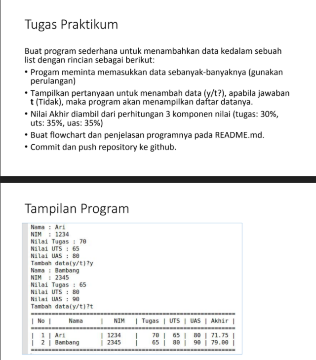
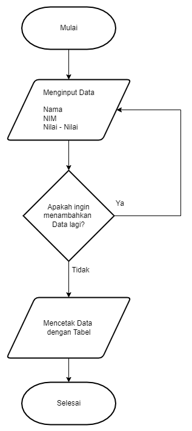
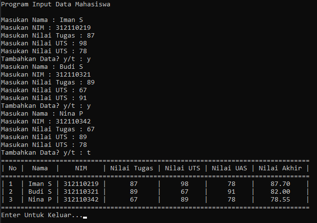

# Iman Setiawan

**Tugas Praktikum - Pertemuan 9**\
**Materi List, Tuple, dan Dictionary**

Berikut soal tugas dari modul.\

Ini adalah flowchart dari program yang akan saya buat.\

Dibawah ini adalah code saya\
Saya juga telah melampirkan filenya\
~~~

from prettytable import PrettyTable

print("Program Input Data Mahasiswa")
print()

tabelNama = PrettyTable(["No" ,"Nama" ,"NIM" ,"Nilai Tugas" ,"Nilai UTS" ,"Nilai UAS" ,"Nilai Akhir" ])
a = 0
while True:
    a += 1
    b = input("Masukan Nama : ")
    c = input("Masukan NIM : ")
    d = int(input("Masukan Nilai Tugas : "))
    e = int(input("Masukan Nilai UTS : "))
    f = int(input("Masukan Nilai UTS : "))
    g = "{:.2f}".format((d*.30) + (e*.35) + (f*.35))
    tabelNama.add_row([a,b,c,d,e,f,g])
    tabelNama.horizontal_char = "="
    tabelNama.junction_char = "="
    
    n = input("Tambahkan Data? y/t : ")
    if n == "T" or n == "t":
            break
print(tabelNama)
input("Enter Untuk Keluar...")

~~~

Berikut adalah output dari code di atas.\
Dengan input data diri dan nilai-nilai.\

